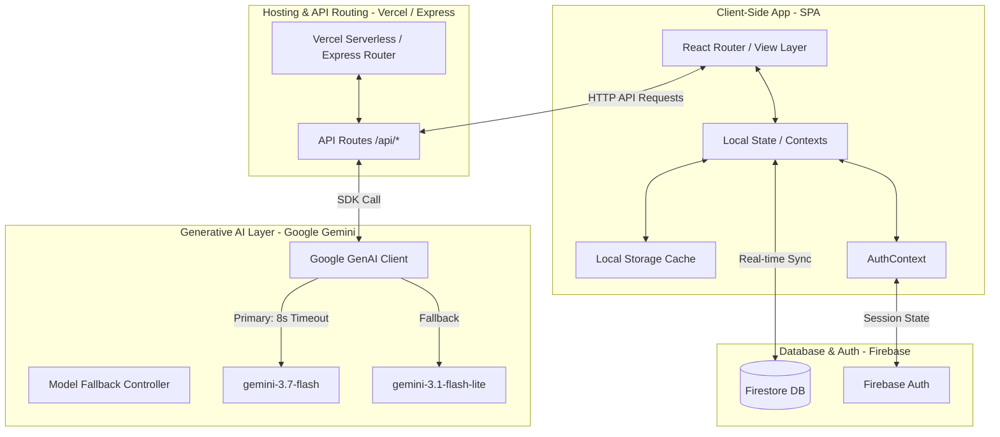
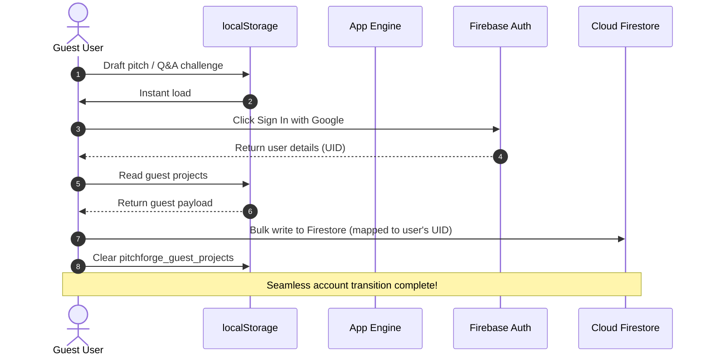

# PitchForge AI - System Architecture

This document details the architectural blueprint, data flows, and security boundaries of **PitchForge AI**.

---

## 🏗 High-Level Architecture Diagram

---

## 🗄 Core Architectural Layers

### 1. Presentation Layer (Client-Side SPA)
- **Framework & Build**: Built on React 19, TypeScript, and Vite.
- **State Management**:
  - `AuthContext`: Manages OAuth state, Anonymous / Guest users, and active session boundaries.
  - Custom subscription streams synchronizing active pitch deck edits securely.
- **Data Caching**: Utilizes `localStorage` for latency-free initial paints of the dashboard while the active subscription handshake with Firestore finishes.

### 2. Synchronization & Migration Flow

### 3. Server-Side Integration (API proxy)
- **Host**: Vercel Serverless / Node.js Express.
- **Security Rule**: To prevent API key extraction, the browser client **never** talks directly to Google Gemini. All generation requests are proxied securely through the `/api/*` endpoints.

### 4. Generative AI Engine (Gemini)
- **SDK**: Utilizes the modern, type-safe `@google/genai` library.
- **Optimized High-Availability Pipeline**:
  - **Primary Model**: `gemini-3.7-flash` (Optimized for lightning-fast structural text and score evaluations).
  - **Timeout Limit**: Restricts request times to **8 seconds** max per model attempt.
  - **Fallback Chain**: If the primary request fails or exceeds the timeout, the pipeline immediately falls back to `gemini-3.1-flash-lite` to ensure continuity.

---

## 🛡 Security Boundaries

1. **Firestore Rules**:
   - Ensures users can **only** read and write documents where `resource.data.ownerId == request.auth.uid`.
   - Strictly validates all schema types (e.g. `score` is a map, `ownerEmail` is a string, and custom evaluation scores are validated).
2. **Secret Management**:
   - `GEMINI_API_KEY` is loaded strictly in the server runtime environment (`process.env`), isolated from browser bundles.
